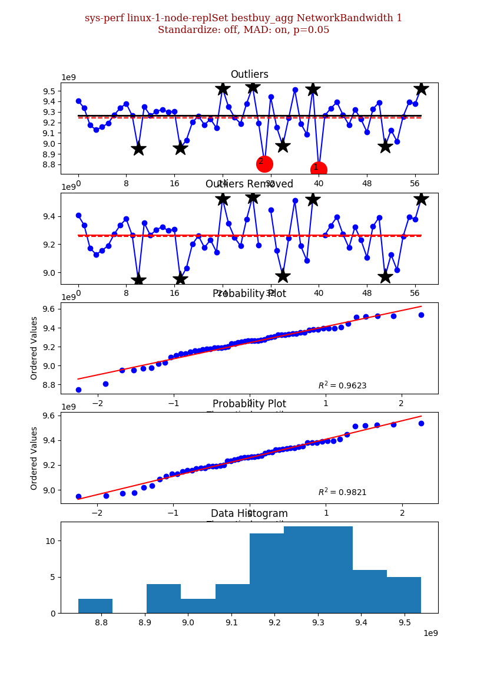
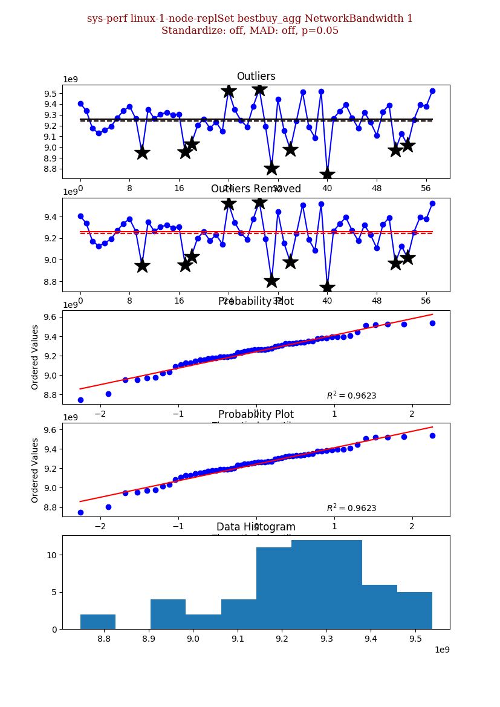

# DSI: Signal Processing

This sub-directory concerns itself with the signal processing functionality. At present it is a suite of software based upon a python version of [e.divisive](https://www.rdocumentation.org/packages/ecp/versions/3.1.0/topics/e.divisive) which is itself based on [this document](https://arxiv.org/pdf/1306.4933.pdf).

## Command Line tools

The signal processing module provides a command line interface through the 'change-points' executable. This executable in turn provides a number of sub-commands (list, mark, hide, etc.) for processing change points.

Think of the 'change-points' exe as equivalent to the 'git' command line executable and 'change-points mark', 'change-points hide' as the git commands (pull / push / checkout).

### Installation

Install the change points command from the DSI repo. For pip, use the following:

    $> pip install -e .

__Note: ./signal\_processing/change-points.py cannot be invoked directly as it does not have a '\_\_main\_\_' block.__

### Invocation

Next verify the *change-points* command works. Run the following command, you should see something like the following output:

    $> change-points
    Usage: change-points [OPTIONS] COMMAND [ARGS]...

      For a list of styles see 'style sheets<https://matplotlib.org/users/style_sheets.html>'.

    Options:
      -d, --debug                     Enable debug output, you can pass multiple -ddddd etc.
      -l, --logfile TEXT              The log file to write to, defaults to None.
      -o, --out TEXT                  The location to save any files in.
      -f, --format TEXT               The format to save any files in.
      -u, --mongo-uri TEXT            MongoDB connection string. The database name comes from here too.
      -q, --queryable TEXT            Print ids as queries
      -n, --dry_run                   Don't actually run anything.
      -c, --compact / --expanded      Display objects one / line.
      --points TEXT                   The points collection name.
      --change_points TEXT            The change points collection name.
      --processed_change_points TEXT  The processed change points collection name.
      --build_failures TEXT           The build failures collection name.
      --style TEXT                    The default matplot lib style to use.
      --token-file TEXT
      --mongo-repo TEXT
      -h, --help                      Show this message and exit.

    Commands:
      compare              Compare points generated from R and python.
      compute              Compute / recompute change point(s).
      help                 Show the help message and exit.
      hide                 Hide a change point(s).
      list                 List points (defaults to change points).
      list-build-failures  Print list of build failures and their linked...
      manage               Manage the infrastructural elements of the...
      mark                 Mark change point(s) as acknowledged.This...
      update               Update an existing processed change point(s).
      visualize            *Note : this command is provided as is and is...

__Note: this lists the options common to all sub-commands.__

The *change-points hide* command is used to mark change points as hidden. Internally it creates a copy of matching documents from the *perf.change_points* collection in the *perf.processed_change_points* collection with the __processed\_type__ field set to hidden.

To see the help documentation invoke the following command:

    $> change-points hide --help
    Usage: change-points hide [OPTIONS] REVISION PROJECT [VARIANT] [TASK] [TEST] [THREAD_LEVEL]

          Hide a change point(s). This process creates a copy of a change_points (ephemeral output of the signal
          processing algorithm) in the (persistent) processed_change_point collection.

      Arguments can be string or patterns, A pattern starts with /.

      REVISION, the revision of the change point. This parameter is mandatory.
      PROJECT, the project name or a regex (like /^sys-perf-3.*/ or /^(sys-perf|performance)$/). This parameter is mandatory.
      VARIANT, the build variant or a regex.
      TASK, the task name or a regex.
      TEST, the test name or a regex.
      THREADS, the thread level or a regex.

      You can use '' in place of VARIANT, TASK, TEST, THREADS if you want to match all. See the
      examples.

      Examples:
          $> revision=bad5afd612e8fc917fb035d8333cffd7d68a37cc

          # dry run on all sys-perf points for a given revision
          $> change-points hide $revision sys-perf -n

          # hide sys-perf change points
          $> change-points hide $revision sys-perf
          $> change-points hide $revision sys-perf linux-1-node-replSet
          $> change-points hide $revision sys-perf '/linux-.-node-replSet/'
          $> change-points hide $revision sys-perf revision linux-1-node-replSet \
             change_streams_latency  --exclude '/^(fio_|canary_)/'
          $> change-points hide $revision sys-perf linux-1-node-replSet change_streams_latency \
          '/^(fio_|canary_)/'

          #  hide all the revision sys-perf find_limit-useAgg 8 thread level
          $> change-points hide $revision sys-perf '' '' find_limit-useAgg 8

          #  hide all the revision sys-perf find_limit-useAgg all thread level
          $> change-points hide  $revision sys-perf '' '' find_limit-useAgg
          $> change-points hide $revision sys-perf '' '' find_limit-useAgg ''

    Options:
      --exclude TEXT  tests are excluded if this matches. It can be provided multiple times. A regex starts with a "/" char
      -h, --help      Show this message and exit.

### Source Code Layout

The code for the command line tool is in __signal\_processing/change\_points.py__. Within this file each sub-command is implemented in a function called '\<subcommand\>\_command'. For example 'change-points mark' is implemented by the *mark_command* function. The command functions are concerned with processing the command line arguments from click and invoking the implementation in the __signal\_processing/commands__ directory. In most cases there is a one to one relationship between the 'change-points \<command name\>' and the python file that implemented it. So the *mark_command* function delegates to __signal\_processing/commands/mark.py__. Some notable exceptions are the *hide_command* which is essentially a synonym of mark with the processed\_type parameter set to hidden. The other case being the *list_command* function which is implemented in __signal\_processing/commands/list\_change\_points.py__ as `list` is a builtin in python and it is a bad idea to reuse a builtin name.

In addition, there is a click group implemented in a function  called 'cli'. This group processes common command line arguments for all the other commands (e.g. -u / --mongo-uri, -d / --debug , -l / --log-file, etc.) and creates a `CommandConfiguration` instance which is passed to each command.

## Database Infrastructure

The state is stored in an Atlas database (called *perf*). A number of indexes and views are required. These database objects are described here.

### Linked Build Failures View

The *perf.linked_build_failures* collection is implemented as a view on the *perf.build_failures* collection. The view lists build failures and their linked change points, build failures that do not link to any change point will not appear in this view.

#### Linked Build Failures Description

A change point gets linked to a build failure if any of the revisions in its __suspect\_revisions__ field match either the __first\_failing\_revision__ or __fix\_revisions__ fields of a build failure.

See [Field Descriptions](#field-descriptions) for an explanation of the documents.

The view pipeline has a number of stages:

   1. Add field named __revision__ that is the __first\_failing\_revision__ and __fix\_revision__ fields concatenated.
   1. Unwind on the new __revision__ field.
   1. Lookup (as __linked\_change\_points__ field) all documents in the *perf.change_points* collection that match *perf.build_failure* documents:
        1. __revision__ *perf.build_failures* field in __all_suspect\_revisions__ *perf.change_points* field.
        1. __project__ field.
   1. Filter documents with empty __linked\_change\_points__ field from the view.

### Unprocessed Change Points Collection

The *perf.unprocessed_change_points* collection is implemented as a view on the *perf.change_points* collection. The view lists all change points that have not been hidden and are not already covered by a build failure.

#### Unprocessed Change Points Description

The *perf.unprocessed_change_points* collection is implemented as a view on the *perf.change_points* collection.

See [Field Descriptions](#field-descriptions) for an explanation of the documents.

The view pipeline has a number of stages:

   1. Lookup (as the __hidden\_processed\_change\_points__ field) all documents in the *perf.processed_change_points* that match *perf.change_points* documents:
        1. __project__ field.
        1. __variant__ field.
        1. __task__ field.
        1. __test__ field.
        1. __thread_level__ field.
        1. __suspect\_revision__ field.
        1. __processed\_type__ field set to *hidden*.
   1. Filter documents with a non-empty __hidden\_processed\_change\_points__ field from the view.
   1. Lookup (as __build\_failures__ field) all documents in *perf.build_failures* that match *perf.build_failures* documents:
        1. __project__ field.
        1. Any *perf.change_points* __all\_suspect\_revisions__ value in __first\_failing\_revision__ or __fix\_revision__ *perf.build_failures* fields
   1. Filter documents with a non-empty __build\_failures__ field from the view.
   1. Remove the __hidden\_processed\_change\_points__ and __build_failures__ fields with a projection.

The remaining documents need to be processed to hide them or to create a Build Failure to track the issue.

#### Field Descriptions

Common document fields:

   1. The __project__ field contains the performance project identifier. For example, 'sys-perf', 'sys-perf-4.0', 'performance'. This field is a scalar value in all cases except *perf.build_failures* where it is an array field. A change point is generated for a single project, variant, task, test and thread_level but build failures can cover many projects (the same logical commit in different project branches).
   1. The __variant__ field contains the performance variant identifier. For example, 'linux-standalone', 'linux-1-node-replSet'.
   1. The __task__ field contains the performance task identifier. For example, 'bestbuy\_agg', 'industry\_benchmarks'.
   1. The __test__ field contains the performance variant identifier. For example, 'find-noAgg', 'ycsb\_100read'.
   1. The __thread\_level__ field contains the number of threads for a given performance result.

A change point document has the following additional relevant fields:

   1. The __suspect\_revision__ field contains the githash revision of the first build that displays the change in performance. This does not mean that it is sure to be the root cause, there could be older revisions which were not yet run.
   1. The __all\_suspect\_revisions__ array field contains the list of revisions which could contain the commit that caused the performance change. __suspect\_revision__ is included in this list.

A build failure (BF) document has the following additional relevant fields:

   1. The __first\_failing\_revision__ array field contains a list of revisions which are currently associated with the root cause of this BF. There can be more than one revision but each revision should be for a single unique project.
   1. The __fix\_revision__ array field contains a list of revisions which are associated with the fix for this BF. There can be more than one revision per project (to cover the case where an issue is fixed in stages or incompletely).  

#### View Creation / Change

After each change, you must update the view in the database.

To create the view in Atlas, you should run the following command:

    $> sp_password=.... # you must set this
    $> change-points -u "mongodb+srv://signal_processing:${sp_password:?not set}@performancedata-g6tsc.mongodb.net/perf" manage

OR create and test the view locally:

    $> change-points -u 'mongodb://localhost/perf' manage

To view the help run:

    $> change-points --help        # view the group help which contains common parameters
    $> change-points manage --help # view the command help

#### Configuration Files

You can create a config file to hold commonly used config parameters.

The CLI looks for configuration files in the following locations (in this order):

1. ./.change-points
1. ${DSI_APP_CONF_LOCATION}/.change-points if DSI_APP_CONF_LOCATION is set and the directory exists.
1. ~/.change-points or whatever is returned by [click_get_app_dir](http://click.pocoo.org/5/api/#click.get_app_dir) for your OS.

The file is assumed to be yaml. A sample config file looks like:

```yaml
# -*-yaml-*-
# Enable debug if debug > 0, you can set higher levels.
debug: 0
# The log file to write to, defaults to None.
logfile: /tmp/change-points.log
# MongoDB connection string. The database name comes from here too.
mongo_uri: mongodb://localhost/perf
# Possible styles are listed at https://matplotlib.org/users/style_sheets.html
# 'style' is an array and you can provide multiple values.
style:
  - bmh
token_file: ./config.yml
mongo_repo: ~/git/mongo-for-hashes
# The following sections are for the sub commands.
# These are over laid on the cli params (above).
compare:
  progressbar: false
  no_older_than: 14
  show: true
compute:
  # Note: Don't add help to a command as it would be confusing. It will
  # always just print help and exit.
  # help: true
  progressbar: true
list:
  limit: 20
  no_older_than: 20
list-build-failures:
  human_readable: true
mark:
  exclude_patterns:
    - this
    - that
update:
  exclude:
    - this
    - that
visualize:
  sigma: 2.0
```

__Note:__ dashes on the command names (e.g. 'list-build-failures') and underscores on the
field names ('human_readable').

The configuration values are applied in the following order:

1. Defined in the CLI code.
1. Defined in the .change-points file (where this is available).
1. Specified in an env var (where this is available).
1. Provided on the command line.

#### Keyring support

__NOTE: It is not recommended that you use the keyrings.alt package. In this case your credentials
are stored in plaintext.__

The attach / detach commands attempt to save to the system keyring if available.

As a first step, in your virtualenv try:

   $ virtualenv venv --system-site-packages
   $ source venv/bin/activate
   $ pip install -e .                          
   
   $ change-points attach BF-11372  e573d7f2f908f3fbe96716851cd1b1e3d65fe7c9 sys-perf 
   $ change-points detach BF-11372  e573d7f2f908f3fbe96716851cd1b1e3d65fe7c9 sys-perf 

If this works (you are only prompted for a username / password once), then you are good to go. If
there are errors then refer to the section for your OS.

##### Linux

Installation can be tricky on Linux.

If the __pip install -e .__ failed then create a virtualenv with access to the system
packages. For mkvirtualenv, the following set of commands may work:

   $ virtualenv venv --system-site-packages
   $ source venv/bin/activate
   $ pip install -e .                          
                             
If this doesn't work then refer to the [keyring homepage](https://pypi.org/project/keyring/#linux).
 
##### MacOS

On MacOS the  __pip install -e .__ generally succeeds but the commands fail with an error
like:

    keyring.errors.PasswordSetError: Can't store password on keychain

Check the signature of your python executable by running the following command:
   
    $ codesign -dvvvvv $(which python)
    Executable=~/.venv/bin/python
    Identifier=org.python.python
    Format=Mach-O universal (i386 x86_64)
    CodeDirectory v=20100 size=290 flags=0x0(none) hashes=4+3 location=embedded
    Platform identifier=4
    Hash type=sha256 size=32
    CandidateCDHash sha256=3e046a90783ab10480cf09372a77c70acba04354
    Hash choices=sha256
    Page size=4096
        -3=7e4502120634435e8591decb7d459047e4536a6180ae689fdc52245c65a7415b
        -2=834eaf91749aac19928be4fd53207f129c9eec188c1facd0012ba2066de9e95c
    CDHash=3e046a90783ab10480cf09372a77c70acba04354
    Signature size=4485
    Authority=Software Signing
    Authority=Apple Code Signing Certification Authority
    Authority=Apple Root CA
    Info.plist=not bound
    TeamIdentifier=not set
    Sealed Resources=none
    Internal requirements count=1 size=68   

The output shows a signature but it is not set to __Signature=adhoc__.

Execute the following command and try the attach / detach command again:

    $ codesign -f -s - $(which python)
    $ change-points attach BF-11372  e573d7f2f908f3fbe96716851cd1b1e3d65fe7c9 sys-perf 
    $ change-points detach BF-11372  e573d7f2f908f3fbe96716851cd1b1e3d65fe7c9 sys-perf 
   

##### Miscellaneous

If there is no keyring available or you do not want to install a keyring, then you can pass in the 
credentials or you will be prompted for them each time.
   
You can disable keyring usage on a machine where the keyring is installed with either
__--no-keyring__ or __--guest__:

    $ change-points attach BF-11372  e573d7f2f908f3fbe96716851cd1b1e3d65fe7c9 sys-perf --guest

In this case you will be prompted for the credentials.


You can also provide a username  with __--no-keyring__ or __--guest__:

    $ change-points attach BF-11372  e573d7f2f908f3fbe96716851cd1b1e3d65fe7c9 sys-perf --guest \
    --username jira_username

In this case, you should only be prompted for the password.


# DSI: Outliers

gesd.py contains an implementation of
[Generalized ESD Test for Outliers](https://www.itl.nist.gov/div898/handbook/eda/section3/eda35h3.htm)
both with standard and modified z scores (Median Absolute Deviation).

## Command Line tools

Currently the tooling allows outlier detection and visualization from the command line. Although
it requires Atlas database access.

### Installation

Install using the same instructions as the change points CLI.

### Invocation

View the top level help as follows:

    $ outliers
    Usage: outliers [OPTIONS] COMMAND [ARGS]...
    
      Outliers CLI.
    
    Options:
      -d, --debug                 Enable debug output, you can pass multiple -ddddd etc.
      -l, --logfile TEXT          The log file to write to, defaults to None.
      -o, --out TEXT              The location to save any files in.
      -f, --format TEXT           The format to save any files in.
      -u, --mongo-uri TEXT        MongoDB connection string. The database name comes from here too.
      -q, --queryable TEXT        Print ids as queries
      -n, --dry-run               Do not actually run anything.
      -c, --compact / --expanded  Display objects one / line.
      --style TEXT                The default matplot lib style to use.
      --token-file TEXT
      --mongo-repo TEXT
      -h, --help                  Show this message and exit.
    
    Commands:
      evaluate Evaluate the GESD algorithm with various...
      help    Show the help message and exit.


To view the config help issue the following command:

    $ outliers config --help
    Usage: outliers evaluate [OPTIONS] PROJECT [VARIANT] [TASK] [TEST] [THREAD_LEVEL]
    
      Evaluate the GESD algorithm with various parameters.
    
    Options:
      -p, --significance FLOAT        Significance level test.
      -m, --max-outliers INTEGER      Max outliers.
      --mad / --no-mad                Use Median Absolute Deviation.
      --visualize / --no-visualize    Plot the series.
      --save / --no-save              Save the plot, does not visualize.
      --subseries / --series          Use Median Absolute Deviation.
      --standardize / --no-standardize
                                      Standardize the time series data.
      --pool-size INTEGER             Set the process pool size. The default is the number of cores - 1.
      --change-point INTEGER          The change point range (python indexing, -1 being the last). The default is the
                                      number of cores - 1.
      -h, --help                      Show this message and exit.

The following command plots and saves outliers for the NetworkBandwidth canary test using Median
Absolute Deivation:

    $ outliers -o ~/tmp/ config sys-perf linux-1-node-replSet bestbuy_agg NetworkBandwidth 1 --mad -m 0 --save
    NetworkBandwidth       [##################################] 100%                                                              


It will generate an image in ~/tmp/sys-perf/linux-1-node-replSet/bestbuy_agg/0.050000/NetworkBandwidth-1-10-on-0.05.png,




To save the standard z-score outlier detection:

    $ outliers -o ~/tmp/ config sys-perf linux-1-node-replSet bestbuy_agg NetworkBandwidth 1 -m 0 --save
    NetworkBandwidth       [##################################] 100%                                                              


Generates ~/tmp/sys-perf/linux-1-node-replSet/bestbuy_agg/0.050000/NetworkBandwidth-1-10-off-0.05.png,




To view the images use:

    $ outliers config sys-perf linux-1-node-replSet bestbuy_agg NetworkBandwidth 1 --mad -m 0 --visualize


To view outliers for all NetworkBandwidth canary tests:

    $ outliers config sys-perf "/^linux-(1|standalone)/" "" NetworkBandwidth --mad -m 0 --visualize
    
## Manual / Local Testing detect_changes or detect_outliers

__Note:__ The following steps use detect_changes as an example, but they also apply to detect_outliers.

__Note:__ The following steps test a main waterfall task. In order to test a patch task, download a
patch diagnostic archive or add an ```is_patch:true``` flag to runtime.yml.


1. Pip install locally from your dsi repo:

    $ cd <dsi repo location>
    $ pip install -e .

1. Get a dump of the Atlas cluster:

    $ mongodump --uri="mongodb+srv://signal_processing:${password:?not set}@performancedata-g6tsc.mongodb.net/perf" --archive=perf.gz --gzip

1. Restore to a local database:

    $ mongorestore --archive=perf.gz --gzip --drop 

1. Download the diagnostic archive from any task. For example [bestbuy_agg on Linux Standalone](https://evergreen.mongodb.com/task/sys_perf_linux_standalone_bestbuy_agg_bb9114dc71bfcf42422471f7789eca00881b8864_19_01_03_20_13_57) is [dsi-artifacts-bestbuy_agg-sys_perf_linux_standalone_bb9114dc71bfcf42422471f7789eca00881b8864_19_01_03_20_13_57-0.tgz](https://s3.amazonaws.com/mciuploads/dsi/linux-standalone/bb9114dc71bfcf42422471f7789eca00881b8864/sys_perf_linux_standalone_bestbuy_agg_bb9114dc71bfcf42422471f7789eca00881b8864_19_01_03_20_13_57/sys_perf_bb9114dc71bfcf42422471f7789eca00881b8864/logs/dsi-artifacts-bestbuy_agg-sys_perf_linux_standalone_bb9114dc71bfcf42422471f7789eca00881b8864_19_01_03_20_13_57-0.tgz)
1. Extract the archive to a local directory

    $ mkdir -pv ~/tmp/test_detect_changes && tar -zxvf dsi-artifacts-bestbuy_agg-sys_perf_linux_standalone_bb9114dc71bfcf42422471f7789eca00881b8864_19_01_03_20_13_57-0.tgz -C ~/tmp/test_detect_changes
    $ cd ~/tmp/test_detect_changes/

1. Edit analysis.yml and change mongo-uri to local database:

    $ sed -i.bak "s/^mongo_uri:.*$/mongo_uri: 'mongodb:\/\/localhost\/perf'/" analysis.yml

1. Run detect_changes from ~/tmp/test_detect_changes directory:

    $ cd ~/tmp/test_detect_changes && detect-changes
    
    
# ETL Scripts
 
There are two ETL scripts for transforming data, etl-jira-mongo and etl-evg-mongo. 
 
### Troubleshooting
 
#### MacOS
 
The etl-evg-mongo script may hit the following error on Macs:

```
objc[11135]: +[__NSPlaceholderDate initialize] may have been in progress in another thread when fork() was called.
objc[11134]: +[__NSPlaceholderDate initialize] may have been in progress in another thread when fork() was called.
```

This can be worked around by adding the `OBJC_DISABLE_INITALIZE_FORK_SAFETY=yes` to the environment the scripts is executing in.

```
OBJC_DISABLE_INITIALIZE_FORK_SAFETY=YES etl-evg-mongo --mongo-uri mongodb://localhost/perf -d --project sys-perf
```
