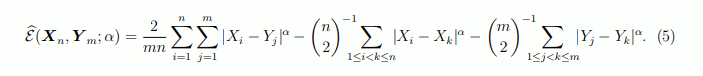

# DSI: Signal Processing

Currently the signal processing is based around the algorithm in the following [paper](https://arxiv.org/pdf/1306.4933.pdf).

This page is based on the analysis [here](https://docs.google.com/document/d/1A97F7RPY6EtXShEfUym7StLSnpuPR17Uy9BEFC1cuKw/edit#heading=h.qhq8ppmxw123).

## What the E-Divisive algorithm does

The E-Divisive algorithm works as follows:

1. Calculate the Q^ Values for the series (see the next section).
1. Select the candidate change point candidate is found simply by finding the maximum q value.
1. Calculate the statistical significance of the candidate change point.
1. If the significance test failed then __STOP__
1. If the significance test passed:
    * Save this change point (```index```)
    * __Repeat:__ 1-6 for the series to the right and left of change point (```series[:index]``` and ```series[index:]```).

### Calculate the Q^ Values for a series

The following equation is used to calculate the q values for a point:


#### Descriptively

1. Take all points in a series and compute pairwise differences between all points (i,j)
1. For each point n, compare:
    * The average of all differences where the first point is to the left of n (i < n) and the second to the right (j >= n), against.
    * The average of all differences between points that are both on the same side of n. Either i,j < n or i,j >= n.
1. This difference is the q-value of n.
    * __Note__:inequalities are intentionally chosen so that the difference between points (n-1) and n are assigned to index n.
    * __Note__: the q-value expresses how much change there is at the point (n-1, n) compared to the average of all pairwise differences elsewhere in the series.

#### Visually representation

Given a 10 element input array, generating a 10 x 10 difference matrix. Calculate each term by summing the difference grid elements containing a 1.

```bash
n 2
  Term1       Term2       Term3
  0123456789  0123456789  0123456789

0 0011111111  0100000000  0000000000 0
1 0011111111  0000000000  0000000000 1
2 0000000000  0000000000  0001111111 2
3 0000000000  0000000000  0000111111 3
4 0000000000  0000000000  0000011111 4
5 0000000000  0000000000  0000001111 5
6 0000000000  0000000000  0000000111 6
7 0000000000  0000000000  0000000011 7
8 0000000000  0000000000  0000000001 8
9 0000000000  0000000000  0000000000 9

n 3
  Term1       Term2       Term3
  0123456789  0123456789  0123456789

0 0001111111  0110000000  0000000000 0
1 0001111111  0010000000  0000000000 1
2 0001111111  0000000000  0000000000 2
3 0000000000  0000000000  0000111111 3
4 0000000000  0000000000  0000011111 4
5 0000000000  0000000000  0000001111 5
6 0000000000  0000000000  0000000111 6
7 0000000000  0000000000  0000000011 7
8 0000000000  0000000000  0000000001 8
9 0000000000  0000000000  0000000000 9

n 4
  Term1       Term2       Term3

  0123456789  0123456789  0123456789
0 0000111111  0111000000  0000000000 0
1 0000111111  0011000000  0000000000 1
2 0000111111  0001000000  0000000000 2
3 0000111111  0000000000  0000000000 3
4 0000000000  0000000000  0000011111 4
5 0000000000  0000000000  0000001111 5
6 0000000000  0000000000  0000000111 6
7 0000000000  0000000000  0000000011 7
8 0000000000  0000000000  0000000001 8
9 0000000000  0000000000  0000000000 9

n 5
  Term1       Term2       Term3

  0123456789  0123456789  0123456789
0 0000011111  0111100000  0000000000 0
1 0000011111  0011100000  0000000000 1
2 0000011111  0001100000  0000000000 2
3 0000011111  0000100000  0000000000 3
4 0000011111  0000000000  0000000000 4
5 0000000000  0000000000  0000001111 5
6 0000000000  0000000000  0000000111 6
7 0000000000  0000000000  0000000011 7
8 0000000000  0000000000  0000000001 8
9 0000000000  0000000000  0000000000 9

n 6
  Term1       Term2       Term3

  0123456789  0123456789  0123456789
0 0000001111  0111110000  0000000000 0
1 0000001111  0011110000  0000000000 1
2 0000001111  0001110000  0000000000 2
3 0000001111  0000110000  0000000000 3
4 0000001111  0000010000  0000000000 4
5 0000001111  0000000000  0000000000 5
6 0000000000  0000000000  0000000111 6
7 0000000000  0000000000  0000000011 7
8 0000000000  0000000000  0000000001 8
9 0000000000  0000000000  0000000000 9

n 7
  Term1       Term2       Term3

  0123456789  0123456789  0123456789
0 0000000111  0111111000  0000000000 0
1 0000000111  0011111000  0000000000 1
2 0000000111  0001111000  0000000000 2
3 0000000111  0000111000  0000000000 3
4 0000000111  0000011000  0000000000 4
5 0000000111  0000001000  0000000000 5
6 0000000111  0000000000  0000000000 6
7 0000000000  0000000000  0000000011 7
8 0000000000  0000000000  0000000001 8
9 0000000000  0000000000  0000000000 9
```

#### Simple _O(n^2)_ Implementation

The calculation of the terms is expressed in one of the following python stanzas.

With __for loops__:

```python
    # calculate diffs, etc.
    for n in range(2, (t - 2)):
        term1 = 0.0
        term2 = 0.0
        term2 = 0.0
        t = len(series)
        for i in range(n):
            for j in range(n, t):
                term1 += diffs[i][j]
        for i in range(n):
            for k in range((i + 1), n):
                term2 += diffs[i][k]
        for j in range(n, t):
            for k in range((j + 1), t):
                term3 += diffs[j][k]

        qhat_values[n] = ....
```

With __list comprehension__:

```python
    # calculate diffs, etc.
    for n in range(2, (t - 2)):
        term1 = sum(diffs[i][j] for i in range(n) for j in range(n, t))
        term2 = sum(diffs[i][k] for i in range(n) for k in range(i+1, n))
        term3 = sum(diffs[j][k] for j in range(n, t) for k in range(j+1, t))

        qhat_values[n] = ....
```

With __numpy array__:

```python
    # calculate diffs, etc.
    row, col = np.meshgrid(series, series)
    diffs = abs(row - col)

    for n in range(2, (t - 2)):
        term1 = np.sum(diffs[:n, n:])
        term2 = np.sum(np.triu(diffs[:n, :n], 0))
        term3 = np.sum(np.triu(diffs[n:, n+1:], 0))

        qhat_values[n] = ....

```

__Notes:__

* _meshgrid_ has a terrible description in the numpy documentation. The best explanation I have found is [here](https://stackoverflow.com/questions/36013063/what-is-purpose-of-meshgrid-in-python-numpy):

> The purpose of meshgrid is to create a rectangular grid out of an array of x values and an array of y values.

So, meshing the same array with itself will give you a matrix with every value extended by row __and__ a matrix with every value extended by column (see the following example).

Subtracting these matrixes produces the difference matrix.

```python
>>> x, y = np.meshgrid(range(10), range(10))
>>> x
array([[0, 1, 2, 3, 4, 5, 6, 7, 8, 9],
       [0, 1, 2, 3, 4, 5, 6, 7, 8, 9],
       [0, 1, 2, 3, 4, 5, 6, 7, 8, 9],
       [0, 1, 2, 3, 4, 5, 6, 7, 8, 9],
       [0, 1, 2, 3, 4, 5, 6, 7, 8, 9],
       [0, 1, 2, 3, 4, 5, 6, 7, 8, 9],
       [0, 1, 2, 3, 4, 5, 6, 7, 8, 9],
       [0, 1, 2, 3, 4, 5, 6, 7, 8, 9],
       [0, 1, 2, 3, 4, 5, 6, 7, 8, 9],
       [0, 1, 2, 3, 4, 5, 6, 7, 8, 9]])
>>> y
array([[0, 0, 0, 0, 0, 0, 0, 0, 0, 0],
       [1, 1, 1, 1, 1, 1, 1, 1, 1, 1],
       [2, 2, 2, 2, 2, 2, 2, 2, 2, 2],
       [3, 3, 3, 3, 3, 3, 3, 3, 3, 3],
       [4, 4, 4, 4, 4, 4, 4, 4, 4, 4],
       [5, 5, 5, 5, 5, 5, 5, 5, 5, 5],
       [6, 6, 6, 6, 6, 6, 6, 6, 6, 6],
       [7, 7, 7, 7, 7, 7, 7, 7, 7, 7],
       [8, 8, 8, 8, 8, 8, 8, 8, 8, 8],
       [9, 9, 9, 9, 9, 9, 9, 9, 9, 9]])
>>> abs(x - y)
array([[0, 1, 2, 3, 4, 5, 6, 7, 8, 9],
       [1, 0, 1, 2, 3, 4, 5, 6, 7, 8],
       [2, 1, 0, 1, 2, 3, 4, 5, 6, 7],
       [3, 2, 1, 0, 1, 2, 3, 4, 5, 6],
       [4, 3, 2, 1, 0, 1, 2, 3, 4, 5],
       [5, 4, 3, 2, 1, 0, 1, 2, 3, 4],
       [6, 5, 4, 3, 2, 1, 0, 1, 2, 3],
       [7, 6, 5, 4, 3, 2, 1, 0, 1, 2],
       [8, 7, 6, 5, 4, 3, 2, 1, 0, 1],
       [9, 8, 7, 6, 5, 4, 3, 2, 1, 0]])
```

* _np.triu_ generates an upper right triangle matrix. Essentially, it masks out the everything __below__ the diagonal in a matrix. See the following links and examples.
* _diffs[:2,n:]_ indexes a sub matrix.  See the following links and examples.

```python
>>> import numpy as np
>>> m = np.arange(16).reshape(4,4)
>>> print(m)
[[ 0  1  2  3]
 [ 4  5  6  7]
 [ 8  9 10 11]
 [12 13 14 15]]
>>> print(m[:2,2:])
[[2 3]
 [6 7]]
>>> print(np.sum(m[:2,2:]))
18
>>> print(np.triu(m))
[[ 0  1  2  3]
 [ 0  5  6  7]
 [ 0  0 10 11]
 [ 0  0  0 15]]
>>> print(np.sum(np.triu(m)))
60
>>> print(np.tril(m))
[[ 0  0  0  0]
 [ 4  5  0  0]
 [ 8  9 10  0]
 [12 13 14 15]]
>>> print(np.sum(np.tril(m)))
90
```

Numpy References:

* ```b[r,c]```: Select items at rows __r__ in column __c__.
* ```b[0:2,1]```: Select items at rows 0 and 1 in column 1.
* ```b[:1]```: Select all items at row 0, (equivalent to ```b[0:1, :]```).
* [numpy.sum](https://docs.scipy.org/doc/numpy/reference/generated/numpy.sum.html): Sum of array elements over a given axis.
* [numpy.triu](https://docs.scipy.org/doc/numpy/reference/generated/numpy.triu.html): Upper triangle of an array.
* [numpy.meshgrid](https://docs.scipy.org/doc/numpy/reference/generated/numpy.meshgrid.html): Upper triangle of an array.
* See the [cheat sheet](https://s3.amazonaws.com/assets.datacamp.com/blog_assets/Numpy_Python_Cheat_Sheet.pdf) for more details.

#### Optimization

The output of the terms(n=2) and terms(n=3) calculations was:

```bash
n 2
  Term1       Term2       Term3
  0123456789  0123456789  0123456789

0 0011111111  0100000000  0000000000 0
1 0011111111  0000000000  0000000000 1
2 0000000000  0000000000  0001111111 2
3 0000000000  0000000000  0000111111 3
4 0000000000  0000000000  0000011111 4
5 0000000000  0000000000  0000001111 5
6 0000000000  0000000000  0000000111 6
7 0000000000  0000000000  0000000011 7
8 0000000000  0000000000  0000000001 8
9 0000000000  0000000000  0000000000 9

n 3
  Term1       Term2       Term3
  0123456789  0123456789  0123456789

0 0001111111  0110000000  0000000000 0
1 0001111111  0010000000  0000000000 1
2 0001111111  0000000000  0000000000 2
3 0000000000  0000000000  0000111111 3
4 0000000000  0000000000  0000011111 4
5 0000000000  0000000000  0000001111 5
6 0000000000  0000000000  0000000111 6
7 0000000000  0000000000  0000000011 7
8 0000000000  0000000000  0000000001 8
9 0000000000  0000000000  0000000000 9
```

The differences between the terms are:

```bash
Difference n = 3, n = 2
  Term1       Term2       Term3
  01-3456789  01+3456789  0123456789
0 0010000000  0010000000  0000000000 0
1 0010000000  0010000000  0000000000 1
+ 0001111111  0000000000  0001111111 -
3 0000000000  0000000000  0000000000 3
4 0000000000  0000000000  0000000000 4
5 0000000000  0000000000  0000000000 5
6 0000000000  0000000000  0000000000 6
7 0000000000  0000000000  0000000000 7
8 0000000000  0000000000  0000000000 8
9 0000000000  0000000000  0000000000 9
```

OR:

* term1 = previous term1 - sum(first 2 elements from col 2) + sum(last 7 elements from row 2)
* term2 = previous term2 + sum(first 2 elements from col 2)
* term3 = previous term3 - sum(last 7 elements from row 2)

The differences for the following iterations are:

```bash
n 4
  Term1       Term2       Term3
  012-456789  012+456789  0123456789
0 0001000000  0001000000  0000000000 0
1 0001000000  0001000000  0000000000 1
2 0001000000  0001000000  0000000000 2
+ 0000111111  0000000000  0000111111 -
4 0000000000  0000000000  0000000000 4
5 0000000000  0000000000  0000000000 5
6 0000000000  0000000000  0000000000 6
7 0000000000  0000000000  0000000000 7
8 0000000000  0000000000  0000000000 8
9 0000000000  0000000000  0000000000 9

n 5
  Term1       Term2       Term3
  0123-56789  0123+56789  0123456789
0 0000100000  0000100000  0000000000 0
1 0000100000  0000100000  0000000000 1
2 0000100000  0000100000  0000000000 2
3 0000100000  0000100000  0000000000 3
+ 0000011111  0000000000  0000011111 -
5 0000000000  0000000000  0000000000 5
6 0000000000  0000000000  0000000000 6
7 0000000000  0000000000  0000000000 7
8 0000000000  0000000000  0000000000 8
9 0000000000  0000000000  0000000000 9

n 6
  Term1       Term2       Term3
  01234-6789  01234+6789  0123456789
0 0000010000  0000010000  0000000000 0
1 0000010000  0000010000  0000000000 1
2 0000010000  0000010000  0000000000 2
3 0000010000  0000010000  0000000000 3
4 0000010000  0000010000  0000000000 4
+ 0000001111  0000000000  0000001111 -
6 0000000000  0000000000  0000000000 6
7 0000000000  0000000000  0000000000 7
8 0000000000  0000000000  0000000000 8
9 0000000000  0000000000  0000000000 9

n 7
  Term1       Term2       Term3
  012345-789  012345+789  0123456789
0 0000001000  0000001000  0000000000 0
1 0000001000  0000001000  0000000000 1
2 0000001000  0000001000  0000000000 2
3 0000001000  0000001000  0000000000 3
4 0000001000  0000001000  0000000000 4
5 0000001000  0000001000  0000000000 5
+ 0000000111  0000000000  0000000111 -
7 0000000000  0000000000  0000000000 7
8 0000000000  0000000000  0000000000 8
9 0000000000  0000000000  0000000000 9
```

This is represented as:

```python
    t = len(series)
    q_values = np.zeros(t, dtype=np.float)

    n = 2
    m = t - n

    # calculate terms(n=2)
    term1 = np.sum(diffs[:n, n:])
    term2 = np.sum(np.triu(diffs[:n, :n], 0))
    term3 = np.sum(np.triu(diffs[n:, n+1:], 0))

    # calculate q value
    q_values[n] = ...

    for n in range(3, (self.length - 2)):
        m = self.length - n
        column_delta = np.sum(diffs[n - 1, :n - 1])
        row_delta = np.sum(diffs[n:, n - 1])

        # With a comprehension
        # column_delta = sum(diffs[n - 1][y] for y in range(n - 1))
        # row_delta = sum(diffs[y][n -1] for y in range(n, t))

        term1 = term1 - column_delta + row_delta
        term2 = term2 + column_delta
        term3 = term3 - row_delta

        # calculate q value
        q_values[n] = ...
```

Numpy References:

* [numpy.sum](https://docs.scipy.org/doc/numpy/reference/generated/numpy.sum.html): Sum of array elements over a given axis.
* [numpy.triu](https://docs.scipy.org/doc/numpy/reference/generated/numpy.triu.html): Upper triangle of an array.
* [np.meshgrid](https://docs.scipy.org/doc/numpy/reference/generated/numpy.meshgrid.html): Make N-D coordinate arrays.
* ```b[0:2,1]```: Select items at rows 0 and 1 in column 1.
* ```b[:1]```: Select all items at row 0, (equivalent to ```b[0:1,:]```).
* See the [cheat sheet](https://s3.amazonaws.com/assets.datacamp.com/blog_assets/Numpy_Python_Cheat_Sheet.pdf) for more details.

### Calculate the statistical significance of the candidate change point

Calculate the statistical significance for the current change point candidate by randomly shuffling the current series, and finding a comparison change point from that random series.

The null hypothesis is that the q-value for the candidate change point is not any larger than the q-value for a random permutation. (For very clear change points, they pass this test 100 times out of 100, yielding a p-value of 0.00.)

```python
if permute_q >= candidate_q:
    above += 1

# later
probability = above / (self.permutations + 1)
if probability > self.pvalue:
    terminated = True
```
