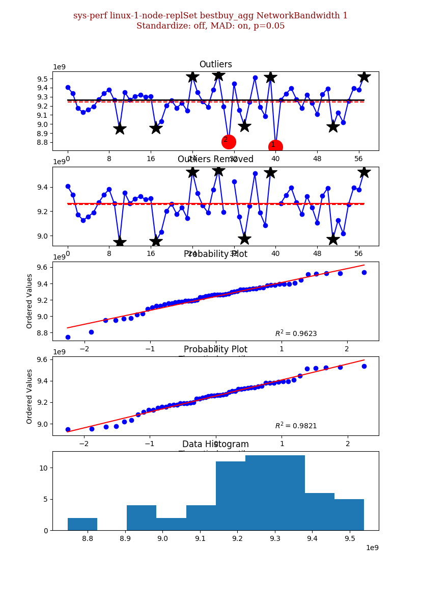
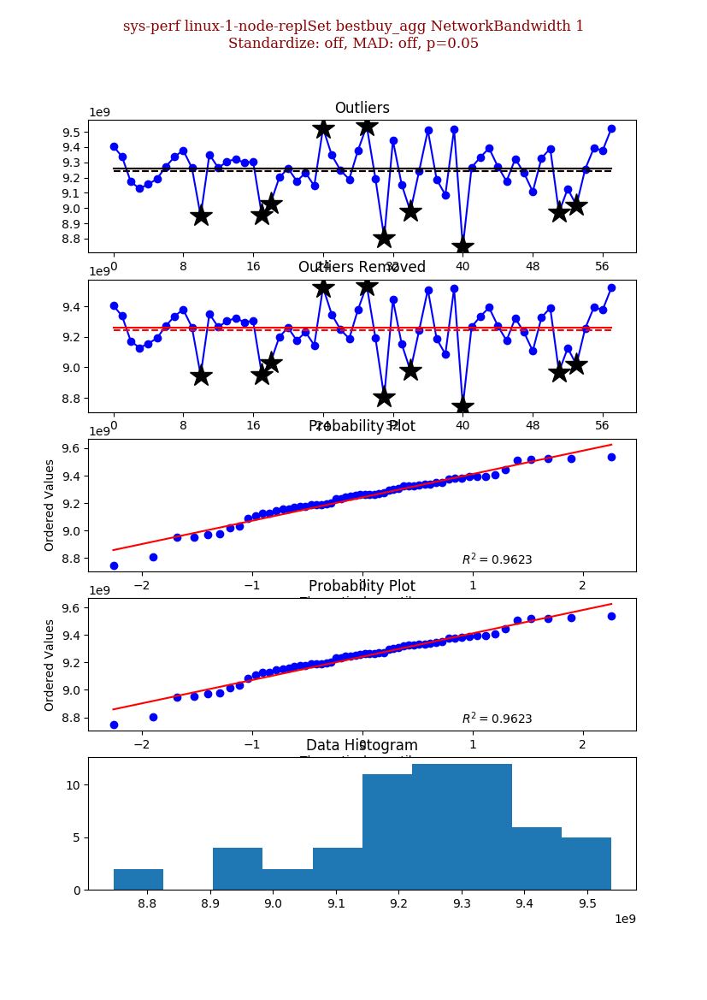

# Outliers

gesd.py contains an implementation of
[Generalized ESD Test for Outliers](https://www.itl.nist.gov/div898/handbook/eda/section3/eda35h3.htm)
both with standard and modified z scores (Median Absolute Deviation).

## Command Line tools

Currently the tooling allows outlier detection and visualization from the command line. Although
it requires Atlas database access.

### Installation

Install using the same instructions as the change points CLI.

### Invocation

View the top level help as follows:

    $ outliers
    Usage: outliers [OPTIONS] COMMAND [ARGS]...
    
      Outliers CLI.
    
    Options:
      -d, --debug                 Enable debug output, you can pass multiple -ddddd etc.
      -l, --logfile TEXT          The log file to write to, defaults to None.
      -o, --out TEXT              The location to save any files in.
      -f, --format TEXT           The format to save any files in.
      -u, --mongo-uri TEXT        MongoDB connection string. The database name comes from here too.
      -q, --queryable TEXT        Print ids as queries
      -n, --dry-run               Do not actually run anything.
      -c, --compact / --expanded  Display objects one / line.
      --style TEXT                The default matplot lib style to use.
      --token-file TEXT
      --mongo-repo TEXT
      -h, --help                  Show this message and exit.
    
    Commands:
      evaluate Evaluate the GESD algorithm with various...
      help    Show the help message and exit.

To view the config help issue the following command:

    $ outliers config --help
    Usage: outliers evaluate [OPTIONS] PROJECT [VARIANT] [TASK] [TEST] [THREAD_LEVEL]
    
      Evaluate the GESD algorithm with various parameters.
    
    Options:
      -p, --significance FLOAT        Significance level test.
      -m, --max-outliers INTEGER      Max outliers.
      --mad / --no-mad                Use Median Absolute Deviation.
      --visualize / --no-visualize    Plot the series.
      --save / --no-save              Save the plot, does not visualize.
      --subseries / --series          Use Median Absolute Deviation.
      --standardize / --no-standardize
                                      Standardize the time series data.
      --pool-size INTEGER             Set the process pool size. The default is the number of cores - 1.
      --change-point INTEGER          The change point range (python indexing, -1 being the last). The default is the
                                      number of cores - 1.
      -h, --help                      Show this message and exit.

The following command plots and saves outliers for the NetworkBandwidth canary test using Median
Absolute Deivation:

    $ outliers -o ~/tmp/ config sys-perf linux-1-node-replSet bestbuy_agg NetworkBandwidth 1 --mad -m 0 --save
    NetworkBandwidth       [##################################] 100%                                                              

It will generate an image in ~/tmp/sys-perf/linux-1-node-replSet/bestbuy_agg/0.050000/NetworkBandwidth-1-10-on-0.05.png,

To save the standard z-score outlier detection:

    $ outliers -o ~/tmp/ config sys-perf linux-1-node-replSet bestbuy_agg NetworkBandwidth 1 -m 0 --save
    NetworkBandwidth       [##################################] 100%                                                              

Generates ~/tmp/sys-perf/linux-1-node-replSet/bestbuy_agg/0.050000/NetworkBandwidth-1-10-off-0.05.png,

To view the images use:

    $ outliers config sys-perf linux-1-node-replSet bestbuy_agg NetworkBandwidth 1 --mad -m 0 --visualize

To view outliers for all NetworkBandwidth canary tests:

    $ outliers config sys-perf "/^linux-(1|standalone)/" "" NetworkBandwidth --mad -m 0 --visualize
    
