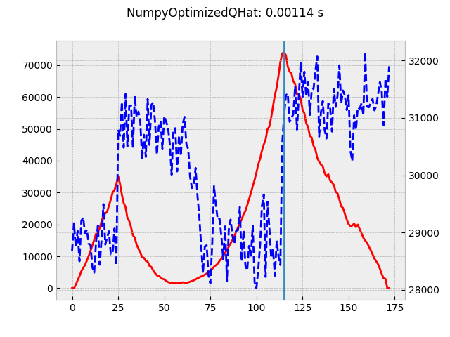
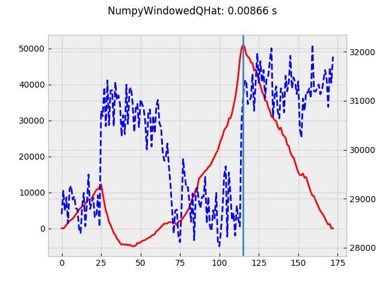

# Signal Processing: Compare implementations

There are currently 5 implementations:

1. __FixedOptimizedQHat__: O(n) implementation (list comprehensions).
1. __NumpyOptimizedQHat__: O(n) implementation.
1. __FixedQHat__: O(n) implementation.
1. __NumpyQHat__: O(n^2) implementation.
1. __OriginalQHat__: O(n^2) implementation.

## Cython Variant

In addition, it is possible to run a [cython](http://cython.org/) variant. From the website, cython is a way to run python code natively.

> Cython is an optimising static compiler for both the Python programming language and the extended Cython programming language (based on Pyrex). It makes writing C extensions for Python as easy as Python itself.

The cython version is very naive, it simply compiles the python to native code. No other cython optimizations are applied.

To use cython you must first update ```setup.py``` and install a cython version:

Edit setup.py and ensure:

```python
from setuptools import setup
from Cython.Build import cythonize

# ....


setup(

    # ... whatever is already there
    ext_modules=cythonize("./signal_processing/profiling/cython_compare_algorithms.pyx")
)

```

Generate and install a cython implementation:

```bash
$> pip install cython
$> cp signal_processing/profiling/compare_algorithms.py  signal_processing/profiling/cython_compare_algorithms.pyx
$> python setup.py build_ext --inplace
$> pip install -e .
```

## Run the compare-algorithms

In the following output:

- __name__: is the Python class name. But note __QHat__ == __NumpyOptimizedQHat__.
- __avg__: is average time in seconds.
- __ratio__: is current avg / min avg. So how many times slower is this than the best.
- __trimmed__: is [trimmed mean](https://docs.scipy.org/doc/scipy/reference/generated/scipy.stats.trim_mean.html) time in seconds. _proportiontocut_=0.1.
- __ratio__: is current trimmed mean / min trimmed mean. So how many times slower is this than the best.
- __min - max__: The best and worst times of this item.
- _P_: indicates pure python.
- _C_: indicates pure cython.

Run only python:

```bash
$ compare-algorithms   --iterations 200
                name        avg    ratio    trimmed    ratio      min - max
--------------------------------------------------------------------------------
                QHat   0.001104      1.00   0.001091     1.00   0.001063 0.001531    P
  NumpyOptimizedQHat   0.001176      1.06   0.001103     1.01   0.001052 0.002157    P
   NumpyWindowedQHat   0.009155      8.29   0.009013     8.26   0.008687 0.013577    P
       OptimizedQHat   0.010026      9.08   0.009863     9.04   0.009498 0.016984    P
           NumpyQHat   0.011746     10.63   0.011574    10.61   0.011396 0.015800    P
        WindowedQHat   0.330290    299.04   0.330290   302.64   0.330290 0.330290    P
        OriginalQHat   0.529545    479.45   0.529545   485.22   0.529545 0.529545    P
```

As __QHat__ === __NumpyOptimizedQHat__, it's good that they are the fastest. They can swap on
subsequent runs but are usually close.

__NumpyOptimizedQHat / QHat__ is about an order of magnitude faster than any of the other reasonable implementations.

Run only cython:

```bash
$ compare-algorithms   --iterations 200 --no-python --cython
                name        avg    ratio    trimmed    ratio      min - max
--------------------------------------------------------------------------------
  NumpyOptimizedQHat   0.001065      1.00   0.001056     1.00   0.001020 0.001663    C
                QHat   0.001114      1.05   0.001094     1.04   0.001066 0.001547    P
       OptimizedQHat   0.008313      7.81   0.008235     7.80   0.008060 0.010949    C
   NumpyWindowedQHat   0.008866      8.33   0.008719     8.26   0.008398 0.012422    C
           NumpyQHat   0.012875     12.09   0.012507    11.84   0.011265 0.023753    C
        WindowedQHat   0.374230    351.47   0.374230   354.38   0.374230 0.374230    C
        OriginalQHat   0.518035    486.53   0.518035   490.56   0.518035 0.518035    C
```

QHat (is NumpyOptimizedQHat) is just slower than a cython NumpyOptimizedQHat. This is good
and indicates that there is not much to be gained from using cython (unless we want to
investigate using it more natively).

__NumpyOptimizedQHat / QHat__ is about an order of magnitude faster than any of the other reasonable implementations.

Run both python and cython:

```bash
$ compare-algorithms   --iterations 200 --cython
                name        avg    ratio    trimmed    ratio      min - max
--------------------------------------------------------------------------------
  NumpyOptimizedQHat   0.001098      1.00   0.001082     1.00   0.001068 0.001580    C
                QHat   0.001132      1.03   0.001111     1.03   0.001082 0.002076    P
  NumpyOptimizedQHat   0.001135      1.03   0.001122     1.04   0.001103 0.001601    P
       OptimizedQHat   0.008454      7.70   0.008349     7.72   0.008249 0.010688    C
   NumpyWindowedQHat   0.009713      8.85   0.009227     8.53   0.008442 0.025718    C
       OptimizedQHat   0.010013      9.12   0.009868     9.12   0.009470 0.015433    P
   NumpyWindowedQHat   0.010275      9.36   0.009992     9.24   0.008626 0.018089    P
           NumpyQHat   0.011923     10.86   0.011735    10.85   0.011470 0.019090    P
           NumpyQHat   0.012524     11.40   0.012201    11.28   0.011502 0.020851    C
        WindowedQHat   0.265278    241.57   0.265278   245.27   0.265278 0.265278    C
        WindowedQHat   0.314862    286.72   0.314862   291.12   0.314862 0.314862    P
        OriginalQHat   0.478099    435.37   0.478099   442.04   0.478099 0.478099    C
        OriginalQHat   0.562285    512.03   0.562285   519.88   0.562285 0.562285    P
```

__NumpyOptimizedQHat / QHat__ is about an order of magnitude faster than any of the other reasonable implementations.

Run tests and view a plot of the q values for windowed and un-windowed implementations:

```bash
$ compare-algorithms   --iterations 1 --plot
                name        avg    ratio    trimmed    ratio      min - max
--------------------------------------------------------------------------------
                QHat   0.001362      1.00   0.001362     1.00   0.001362 0.001362    P
  NumpyOptimizedQHat   0.001372      1.01   0.001372     1.01   0.001372 0.001372    P
   NumpyWindowedQHat   0.009484      6.96   0.009484     6.96   0.009484 0.009484    P
           NumpyQHat   0.012510      9.19   0.012510     9.19   0.012510 0.012510    P
       OptimizedQHat   0.013123      9.64   0.013123     9.64   0.013123 0.013123    P
        WindowedQHat   0.307880    226.05   0.307880   226.05   0.307880 0.307880    P
        OriginalQHat   0.527972    387.64   0.527972   387.64   0.527972 0.527972    P
```

You should see something like the following images:



## Run CProfile

The cprofiler can be run as follows:

```bash
$ python -m cProfile  $(which change-points) -l ~/tmp/compute.log compute sys-perf linux-standalone bestbuy_agg --pool-size 1 --no-progressbar | tee /tmp/profile.txt
$ sort -k4,4 -rn /tmp/profile.txt | head -20
        1    0.001    0.001   21.124   21.124 change-points:3(<module>)
        1    0.000    0.000   20.565   20.565 core.py:720(__call__)
        1    0.000    0.000   20.565   20.565 core.py:638(main)
        2    0.000    0.000   20.564   10.282 core.py:890(invoke)
        2    0.000    0.000   20.564   10.282 core.py:498(invoke)
        1    0.000    0.000   20.564   20.564 core.py:1027(invoke)
        1    0.002    0.002   20.563   20.563 change_points.py:615(compute_command)
        1    0.000    0.000   20.563   20.563 decorators.py:26(new_func)
       35    0.003    0.000   20.535    0.587 compute.py:14(compute_change_points)
       35    0.003    0.000   20.518    0.586 detect_changes.py:131(compute_change_points)
       55    0.001    0.000   20.233    0.368 qhat.py:615(change_points)
       55    0.251    0.005   20.228    0.368 qhat.py:623(_compute_change_points)
    25810    3.316    0.000   17.625    0.001 qhat.py:561(qhat_values)
  3589530    3.037    0.000    8.797    0.000 fromnumeric.py:1730(sum)
  3589530    0.721    0.000    5.113    0.000 _methods.py:31(_sum)
  3643388    4.635    0.000    4.635    0.000 {method 'reduce' of 'numpy.ufunc' objects}
    25810    0.239    0.000    1.660    0.000 qhat.py:546(calculate_diffs)
  1781342    1.618    0.000    1.618    0.000 qhat.py:520(calculate_q)
    51620    0.114    0.000    1.337    0.000 twodim_base.py:408(triu)
    25810    0.256    0.000    1.304    0.000 function_base.py:4554(meshgrid)
```

This is post optimizations so spending more time on ```qhat.py:561(qhat_values)``` may be warranted later.

You can visualize the calls with snakeviz:

```bash
$ python -m cProfile -o /tmp/profile..prof_file  $(which change-points) -l ~/tmp/compute.log compute sys-perf linux-standalone bestbuy_agg --pool-size 1
compute                [##################################] 100%
$ pip install snakeviz
$ snakeviz /tmp/profile.prof_file
```

## Conclusions

As you can see from the results in the previous section, the _NumpyOptimizedQHat_ version is the fastest implementation by a factor of ~10x than the _FixedOptimizedQhat_ version.

In addition, the _cython_ version is between 5 to 10% faster than the pure _python_.

It is interesting to note that the O(n^2) _NumpyQHat_ implementation is close to the performance of the O(n) _FixedOptimizedQHat_ version.

__Given the fact that the cython version is only 10% faster, it is not worth using this tool.__ The cython implementation is naive, a more native implementation may be faster but it would make the code more difficult to maintain and may not work with on all platforms with all implementations.

__NOTE:__ It should be possible to implement the same sort of optimization on the windowed version as in the current QHat. That should be investigated at some stage.

Most of the run time is still spend in ```qhat.py:561(qhat_values)```, more work may be warranted later.
For example:

- Make the array immutable (this seems to give some benefit).
- Make the array an int (if possible). This would need to be validated.
- Reduce the number of permutations.
- Avoid unnecessary calculations.
  - Hash the input series and cache the q values.
  - Use a sub matrix of an existing difference matrix.
  - Replace the optimized implementation with a native implementation. The current implementation uses quite simple arithmetic and array indexing.
