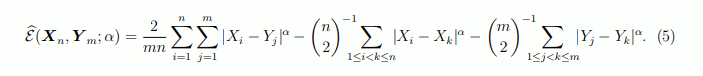

# DSI: Signal Processing

Currently the signal processing is based around the algorithm in the following [paper](https://arxiv.org/pdf/1306.4933.pdf).

This page is based on the analysis [here](https://docs.google.com/document/d/1A97F7RPY6EtXShEfUym7StLSnpuPR17Uy9BEFC1cuKw/edit#heading=h.qhq8ppmxw123).

## What the Q^ algorithm does

The Q^ algorithm works as follows:

1. Calculate the Q^ Values for the series.
1. Select the candidate change point candidate is found simply by finding the maximum q value.
1. Calculate the statistical significance of the candidate change point.
1. If the significance test failed then __STOP__
1. If the significance test passed:
    * Save this change point (```index```)
    * __Repeat:__ 1-6 for the series to the right and left of change point (```series[:index]``` and ```series[index:]```).

### Calculate the Q^ Values for a series

The following equation is used to calculate the q values for a point:


Descriptively:

1. Take all points in a series and compute pairwise differences between all points (i,j)
1. For each point n, compare:
    * The average of all differences where the first point is to the left of n (i < n) and the second to the right (j >= n), against.
    * The average of all differences between points that are both on the same side of n. Either i,j < n or i,j >= n.
1. This difference is the q-value of n.
    * __Note__:inequalities are intentionally chosen so that the difference between points (n-1) and n are assigned to index n.
    * __Note__: the q-value expresses how much change there is at the point (n-1, n) compared to the average of all pairwise differences elsewhere in the series.

### Calculate the statistical significance of the candidate change point

Calculate the statistical significance for the current change point candidate by randomly shuffling the current series, and finding a comparison change point from that random series.

The null hypothesis is that the q-value for the candidate change point is not any larger than the q-value for a random permutation. (For very clear change points, they pass this test 100 times out of 100, yielding a p-value of 0.00.)

```python
if permute_q >= candidate_q:
    above += 1

# later
probability = above / (self.permutations + 1)
if probability > self.pvalue:
    terminated = True
```
